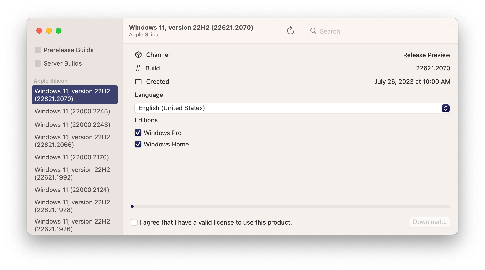

CrystalFetch
============
[][1]

CrystalFetch is a macOS application that creates Windows® 11 installer ISO images. It can be used with [UTM virtual machines][3] as well as other VM solutions.

Note: CrystalFetch is not affiliated with Microsoft and a valid license is required to install Windows® 11.

   
  

Building
--------
1. Make sure submodules are fetched with `git submodule update --init`
2. If you have a paid Apple Developer license, copy `CodeSigning.xcconfig.sample` to `CodeSigning.xcconfig` and fill out the file with your developer information.
3. If you do not have a paid Apple Developer license, you need to disable library validation. For each build target in the project, go to "Signing & Capabilities" and check "Disable Library Validation".
4. You can now build and run the project from Xcode.

Credits
-------
CrystalFetch uses [UUPDump][3] APIs and converter scripts.

CrystalFetch uses [esd2iso][4] by Technogeezer.

This project is not affiliated with Microsoft Corporation. Windows® is a registered trademark of Microsoft Corporation.

  [1]: https://github.com/TuringSoftware/CrystalFetch/actions?query=event%3Arelease+workflow%3ABuild
  [2]: https://mac.getutm.app
  [3]: https://uupdump.net
  [4]: https://communities.vmware.com/t5/VMware-Fusion-Documents/w11arm-esd2iso-a-utility-to-create-Windows-11-ARM-ISOs-from/ta-p/2957381
